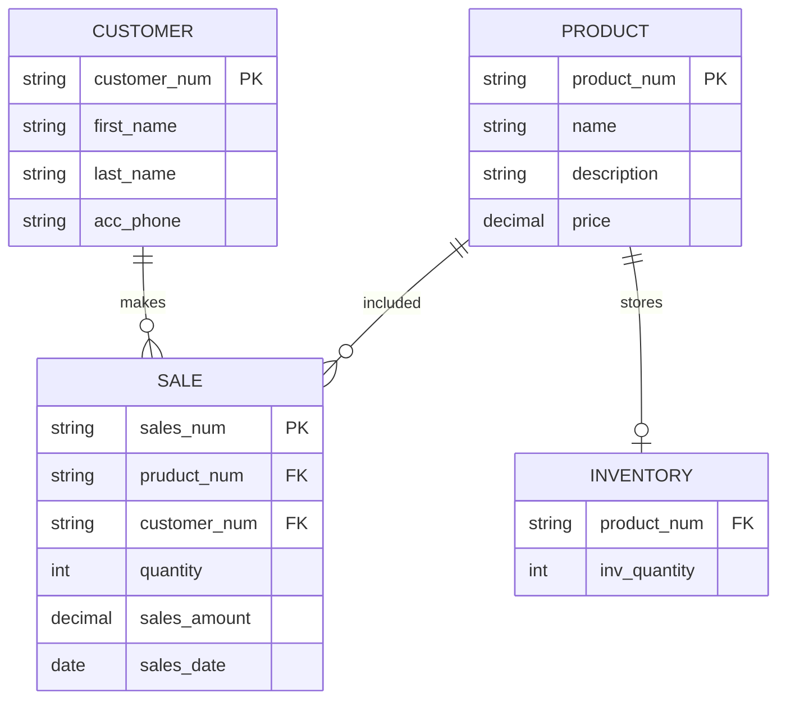

## Descriptions of entity attributes

### PRODUCT
- product_num PK : The product number representing the different shoe models. PK represents a primary key to uniquely identitify each product of the table.
- name : Name of the shoes.
- description : describes the style and size of shoes.
- price : the price of the shoes.

### CUSTOMER
- customer_num PK : The unique number representing each customer, defined with Primary Key to uniquely identify each customer.
- first_name : first name of customer.
- last_name :  last name of customer.
- acc_phone : phone number of account for records.

### SALE
- sales_num PK : The unique sales number that references the transaction, defined with Primary Key.
- product_num FK : Foreign key that links to the product sold.
- customer_num FK : Foreign key that links to the customer's account number.
- quantity : the number of shoes sold.
- sales_amount : The total for the transaction.
- date : The date of the transaction.

### INVENTORY
- product_num FK : Foreign key that links the product sold to the inventory
- int inv_quantity : Number of pairs available for purchase

## Description of Relationships
- CUSTOMER to SALE -  one customer can "make" many purchases which is why it is defined as one-to-many " ||--o{ "
- PRODUCT to SALE - a product can be a part of (included in) many purchases, which is why it is defined as one-to-many
- PRODUCT to INVENTORY - The product is managed under the inventory of a single shoe store, which states the number on hand (stores). This is defined as One-to-One " ||--o| "
